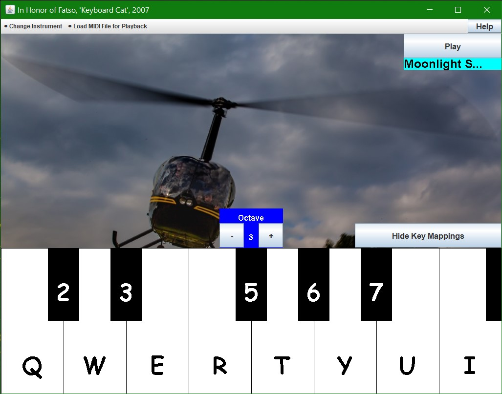

# What Is It?
## Multiple Instruments

In short, you can play a bunch of different instruments. On the right, you can see our pitched helicopter-sounds "instrument" in use. Funky!

## Load Tracks
You can also load in MIDI files for your listening pleasure, or you can use them as backing tracks!

# How Do I Use It?
## User Guide
Check out our [README.txt](https://github.com/djshuster/musical-keyboard/blob/main/README.txt) file!

## General Instructions
To compile and run, use javac \*.java and java Main in the command prompt respectively.

Your computer keyboard keys 'q', '2', 'w', '3', 'e', 'r', '5', 't', '6', 'y', '7', 'u', 'i' correspond to C4 (middle C on a piano) through C5 (one octave higher than middle C).
So if you push ‘q’ your keyboard, it will play a C4, and so on.
The number keys (2, 3, 5, 6, 7) play black keys while the letters (q, w, e, r, t, y, u, i) play white keys on the piano.

You can have the corresponding computer keys shown on the on-screen keys by pressing the “Display Key Mappings” button on top of the keyboard.

To change your active instrument, use the "Change Instrument" menu in the top left.
To change octave, press + or -, or use left or right arrow keys.

To load a backing track to play along with, you can open the “Load MIDI File” menu and select the song you wish to load. Then simply press “Play” to play, and 
“Pause” to pause the song. To restart the song, select it again in the menu.

## Instruments
Some "instruments," like the helicopter or seashore, will require you to hold down the key before the sound really begins to be audible.
To add instruments:

(1) Visit http://fmslogo.sourceforge.net/manual/midi-instrument.html (or any other website that lists your desired instrument). Find its corresponding number.

(2) and open up insInitializer.java.

(3) Add it by putting this line of code where indicated in the java file: "insList.add(new Instrument("<Name of Instrument>", <MIDI number code for instrument>));". Save that file. By default, the background will be gray for a newly added instrument. If you would like to add a custom background image, name it <Name of Instrument>.jpg and place it in the "Backgrounds" folder. Note: for best results, aim to resize the image to about 1024x468, or else the background will either have some gray or some of your image will be covered up by the keyboard.

(4) Finally, recompile and rerun the program.
  
## Playback of MIDI Files
To add or remove a MIDI track from the "Load MIDI File for Playback" menu:
First open the "Tracks" folder. Add or remove your desired MIDI file. Note that it must be a MIDI file. Then recompile and rerun the program.

# Program Structure
Check out pages 2-11 of ["Program Specification.pdf"](https://github.com/djshuster/musical-keyboard/blob/main/Program%20Specification.pdf) to learn more about the classes and how they relate to each other.

# Contact Me
Did you encounter a bug in our application? Do you want to request a new feature? Have a funny meme for us?
Email me at djs.shuster@gmail.com.

# Acknowledgements
Project was coded by Sabir Meah, Nat Roth, and David Shuster.
MIDI files and background images found in the Tracks and Backgrounds folders are royalty-free; thank you to the authors!
Thank you to Rob Camick for kindly providing use of CloseListener.java.
Thank you also to Professors Alfeld and Kaplan for providing knowledge from lectures and code from labs and projects, a great deal of which was appropriated for our uses.
Also thanks to Fatso, a.k.a. Keyboard Cat, for being cute and being our muse.
